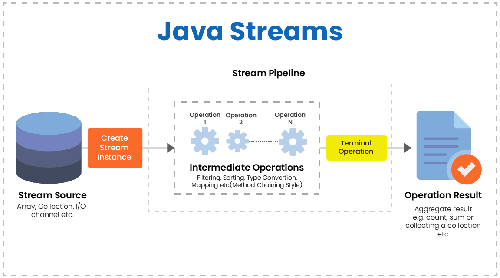

# Лекция 23.05.2024. Как писать на Java в функциональном стиле

**Спойлер:**
1. на практике невозможно программировать в чисто функциональном стиле на языке Java
2. наговнокодить можно на любом языке и в любом стиле, гарантий нет, есть здравый смысл и code review

## Функциональный подход: фундаментальные особенности

1. Чистые функции, отсутствие сайд-эффектов. Метафора "Получить аргумент — вернуть результат"
   Сайд-эффект у функции - это любое воздействие, которое функция оказывает на состояние программы или внешние системы, кроме возвращаемого значения. В идеале функция должна быть чистой, что означает, что она зависит только от своих входных параметров и не изменяет состояние программы или внешних систем. Однако, в реальности многие функции имеют сайд-эффекты. Без сайд-эффектов наши программы в реальном мире бессмысленны.
   Виды сайд-эффектов: изменение глобальных переменных, запись в лог/консоль, исключения (exceptions)

   Без сайд-эффектов не обойтись, но их применение должно быть осознанным и не повсеместным.

2. "Алгебраическая" функция возвращает ровно один результат для каждого значения аргумента (ссылочная прозрачность)
   Cвойство программы, которое делает её гораздо понятнее. Она также включает оптимизацию типа «сохранение вместо повторного вычисления» для дорогостоящих или длительных операций — процесс, носящий название мемоизации (memoization) или кэширования (caching)
3. Иммутабельность. Копируем данные, вместо того, чтобы обновить напрямую
   Неизменяемые объекты просты (в отладке), потокобезопасны, атомарны.

   _Классы должны быть неизменяемыми, если только нет очень важной причины, чтобы сделать их изменяемыми_ (с) Джошуа Блох

   Проблема: shared mutable state (разделяемые изменяемые данные)
   Есть объект, ссылка на него есть в нескольких других объектах. Кто владелец? Правильно ли среагируют остальные, если один внесёт изменения? Будет ли это потокобезопасно?

4. Рекурсия vs итерирование
   Рекурсия (recursion) — поощряемая в функциональном программировании методика,
   направляющая мысли разработчиков в русло ответа на вопрос «что делать?». Чисто
   функциональные языки программирования обычно не содержат таких итеративных
   конструкций, как циклы while и for. Подобные конструкции часто служат неявными
   приглашениями к изменениям значений. Например, необходимо обновлять условие
   в цикле while; в противном случае цикл выполнится ноль или бесконечное число раз

5. Более лаконичный и выразительный код, благодаря декларативному подходу

   Императивный подход отвечает на вопрос "как именно сделать?" вместо "что нужно в результате?" В этом стиле мы многословно ("вербозно") имитируем низкоуровневый лексикон компьютера, вместо декларативного описания того, что хотим получить в итоге (как в SQL)

---

Функциональное программирование часто упоминается в контексте теории категорий. Это раздел математики, изучающий свойства отношений между объектами, не зависящие от внутренней структуры объектов. Максимально абстрактный набор рассуждений о чём бы то ни было. Настолько абстрактный, что другие математики называют эту область знаний "Abstract nonsense". Кроме того, это предмет многолетнего холивара в разработке между адептами императива и функциональщины. Монады, функторы, морфизмы — это всё оно.

**Хорошая новость**: вам не нужно вникать в теоркат, чтобы получить первоначальное представление о функциональном подходе, и начать его применять.

---

## Вроде бы Java — ООП, откуда там функциональщина?

##### Functions are everywhere! У нас есть лямбды, high-order functions, каррирование, частичное применение функций.

Что такое лямбда-выражение?
- анонимная функция
- главные атрибуты лямбды: параметры, тело, и возвращаемый тип
- не привязаны к какому-либо классу, как обычные методы
- может быть присвоена переменной и передаваться в качестве значения в другие функции (высшего порядка)

**Синтаксис**: ( ) -> { }

**Функциональные интерфейсы в Java:**
- Consumer – BiConsumer
- Predicate - BiPredicate
- Function – BiFunction, UnaryOperator, BinaryOperator
- Supplier

**Method References**
- улучшают читабельность
- являются ссылкой на метод (лямбду)

```
ClassName::instance-methodName
ClassName::static-methodName
Instance::methodName
```


**Функциональные паттерны (кто сказал "Монада?")**
Класс Optional — реализация этого паттерна

Как мы решили проблему потенциального отсутствия объекта с помощью типа Optional?
1. Обозначили явно проблему в типе объекта
2. Спрятали весь вспомогательный код (проверка на отсутствие объекта) внутрь этого типа
3. Передали типу набор простых стыкующихся действий


##### Потоки данных (Streams API)

- Представлены в Java 8 (2014 год)
- Основная цель — удобно производить операции над коллекциями
- Легко распараллелить обработку коллекции (но есть подводные камни)
- Уменьшение объёма кода за счет использования лямбд и функциональных интерфейсов
- Поддержка неизменяемости: предоставление неизменяемого состояния по умолчанию, что упрощает многопоточность
- Декларативный подход и улучшенная читаемость кода
- Ленивое (отложенное) вычисление


|                 |                                    |                                     |
|-----------------|------------------------------------|-------------------------------------|
| **Особенности** | **Collections**                    | **Streams**                         |
| Назначение      | Для хранения и группировки данных  | Для выполнения операций над данными |
| Изменение       | Можно добавлять и удалять элементы | Нельзя добавлять и удалять элементы |
| Обход           | Можно обойти несколько раз         | Можно обойти только один раз        |
| Создание        | Создаются "жадно" (eagerly)        | Конструируются лениво               |




## Effective Java by Joshua Bloch (3rd edition, 2018)

##### Lambdas and Streams

42. Prefer lambdas to anonymous classes
43. Prefer method references to lambdas
44. Favor the use of standard functional interfaces
45. Use streams judiciously
46. Prefer side-effect-free functions in streams
47. Prefer Collection to Stream as a return type
48. Use caution when making streams parallel

## Релевантные ссылки

1. https://en.wikipedia.org/wiki/Abstract_nonsense
2. Effective Java by Joshua Bloch: https://www.oreilly.com/library/view/effective-java-3rd/9780134686097/
3. Effective Java Summary: https://github.com/david-sauvage/effective-java-summary
